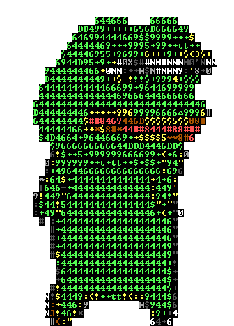

<html>
<head>

</head>
<body>

<h1>GET OUT FKING NORMIES</h1>
<table border="1">
<tr> <td><h1> GET  </h1> </td>
		<td><h1> OUT </h1></td> </tr>
<tr> <td><h1> FKING </h1></td>
		<td><h1>NORMIES</h1></td> </tr>
</table>
</body>
</html>